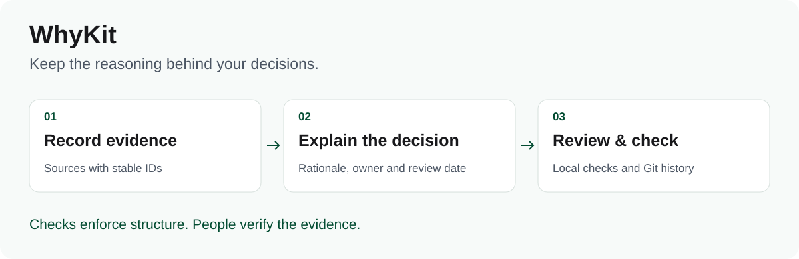

# WhyKit

**The layer that remembers why.**

> Git-native evidence and decision ledger for teams and AI agents.

WhyKit keeps sources, decisions, their reasoning, and review events together in
plain Markdown and Git. It gives people and tools a shared, inspectable record of
what is known, what was decided, and what still needs checking.



**Python 3.11+ · No runtime dependencies · Apache-2.0**

**Status:** preview; no public PyPI release yet. Install from a source checkout.

The checkout instructions require Python 3.11+ and [`uv`](https://docs.astral.sh/uv/getting-started/installation/).
WhyKit itself has no runtime dependencies.

## Why WhyKit

Teams can find old documents but often cannot tell which evidence supported a
decision, which assumptions remain untested, what replaced an earlier choice, or
when anyone last checked that the reasoning still holds. WhyKit makes those
relationships explicit and reviewable:

```text
source (E-001) → decision (D-001) → dated review events
```

- **Keep evidence traceable.** Give each source a stable ID and record where a
  person can inspect it.
- **Keep accepted reasoning intact.** Supersede an old decision instead of
  quietly rewriting its rationale; record reviews as append-only events.
- **Check the same rules locally and in CI.** Start with warnings while drafting,
  then apply the repository's configured policy at stronger gates.
- **Give tools bounded context.** Search, graph, context-pack, and read-only MCP
  interfaces expose structured views without replacing the Markdown source.

WhyKit checks structure and traceability, **not whether a source or conclusion is
true**. A citation can be present and still be wrong. Human review remains
essential.

## Start here

Until the first package release, install from a checkout.

```bash
git clone https://github.com/CometWeb-io/whykit.git
cd whykit
uv sync --locked
uv run whykit init ../my-ledger
uv run whykit lint --root ../my-ledger
```

A new vault has **zero lint errors**. Its warnings point to unanswered questions
in `AGENTS.md` that each adopter must answer before relying on agents.
The default layout is vendor-neutral. Use `whykit init --full ../my-ledger` only
if you specifically want the optional GTM-oriented workstream scaffold.
`--minimal` remains as a compatibility alias. The example creates the vault
beside the source checkout so private notes are not accidentally written into
the WhyKit repository.
For a non-empty destination, `init --force` adds missing starter files without
replacing existing notes, policies, or agent instructions. It retains custom
`.gitignore` rules and appends WhyKit's protective defaults where needed; it
is not a reset or template-upgrade command.

Already have Markdown? Inventory it first, then decide what to adopt:

```bash
uv run whykit adopt ../old-docs --into ../my-ledger --profile obsidian-loose --json
uv run whykit adopt ../old-docs --into ../my-ledger --profile generic --write
```

The first command is a dry run. `--write` copies selected notes into a new
dated batch under the vault's `.import-staging/` area and writes a migration
report there. Repeated imports keep separate batches, and a source file named
`MIGRATION.md` is preserved instead of being replaced by the report. It does
not silently turn the inventory into canonical decisions. The readiness
percentage checks front matter against WhyKit's linter, **not** links, evidence,
decision integrity or approval.
The time estimate is heuristic. Adoption scans UTF-8 `*.md` only; review other
assets separately. It flags known evidence-register and decision-log table
layouts that require manual mapping. The permanent ingestion record includes
full source SHA-256 hashes; staging itself is gitignored.

Vaults with fast-changing evidence can opt into access-age warnings by source
type in `whykit.toml`:

```toml
[evidence_access_age_days]
analytics = 30
"vendor doc" = 180
```

This checks the active register row's `Accessed` date as of `lint --today` (or
today). It is a warning, not proof that the source is still correct. Historic
types can be left out. Evidence being registered or recently accessed is also
not permission to publish a claim; publication approval belongs to the owner's
claims/review workflow.

When WhyKit is published to PyPI, install it with `uv tool install whykit` (or
`pipx install whykit`). Until then, use `uv run whykit` from the repository
checkout as shown above.

## The working loop

1. **Capture a source** with a stable evidence ID and a checkable location.
2. **Record a decision** that cites the evidence, states its rationale, and names
   a review date when accepted.
3. **Re-check it later.** Record a review event; if the reasoning changes, create
   a superseding decision instead of editing accepted rationale in place.
4. **Run the gate** that matches the moment: `local` while editing, `ci` in a
   pull request, and `release` only against the clean candidate commit you mean
   to publish. The release profile rejects a dirty working tree; stashing edits
   does not test them.

The example vaults show the format at two scales: [tiny](examples/tiny/) for the
smallest working setup, and [Northline](examples/northline/) for a fictional,
fully linked organization. All Northline people, companies, vendors, evidence,
metrics, and decisions are synthetic teaching material.

## What WhyKit is — and is not

WhyKit is a **file format, CLI, linter, schemas, and optional integrations**. The
canonical records stay as ordinary Markdown in a Git repository. Obsidian is an
optional editor, not a requirement; agents and AI providers are optional too.

WhyKit is not an AI memory service, a vector database, a CRM, a task manager, or
an access-control boundary. Sensitivity labels are metadata, not permissions.
Keep real company vaults private and grant repository access deliberately. See
the [security policy](SECURITY.md).

## Common tasks

| Need | Start with |
|---|---|
| Create a vault or import Markdown | `whykit init`, `whykit adopt` |
| Add a decision, source, or note | `whykit new decision`, `evidence`, `note` |
| Check integrity and policy | `whykit lint`, `whykit check`, `whykit history` |
| Find related records or prepare agent context | `whykit query`, `context`, `pack`, `graph`, `impact` |
| Review decisions and source lifecycle | `whykit review`, `whykit evidence`, `whykit snapshot` |

Run `uv run whykit --help` for the full CLI. The optional [MCP server](docs/mcp.md)
exposes only read-only query, context, and impact operations.

## Documentation

| If you want to… | Read |
|---|---|
| Follow the complete workflows and CI setup | [Usage guide](docs/guide.md) |
| Configure policy profiles | [Configuration](docs/configuration.md) |
| Understand lint findings | [Rule reference](docs/rules.md) |
| Connect an MCP client | [MCP server guide](docs/mcp.md) |
| Connect producers or machine consumers | [Integrations](docs/integrations.md) |
| Explore the optional local viewer | [Explorer](apps/explorer/) |
| Contribute a change | [Contributing](CONTRIBUTING.md) |
| Read the community expectations | [Code of Conduct](CODE_OF_CONDUCT.md) |
| Understand the project boundary | [Positioning](docs/project-positioning.md) |

Built and maintained by [CometWeb](https://cometweb.io). See the [Apache-2.0
license](LICENSE), [security policy](SECURITY.md), and [release checklist](.github/RELEASE.md).
